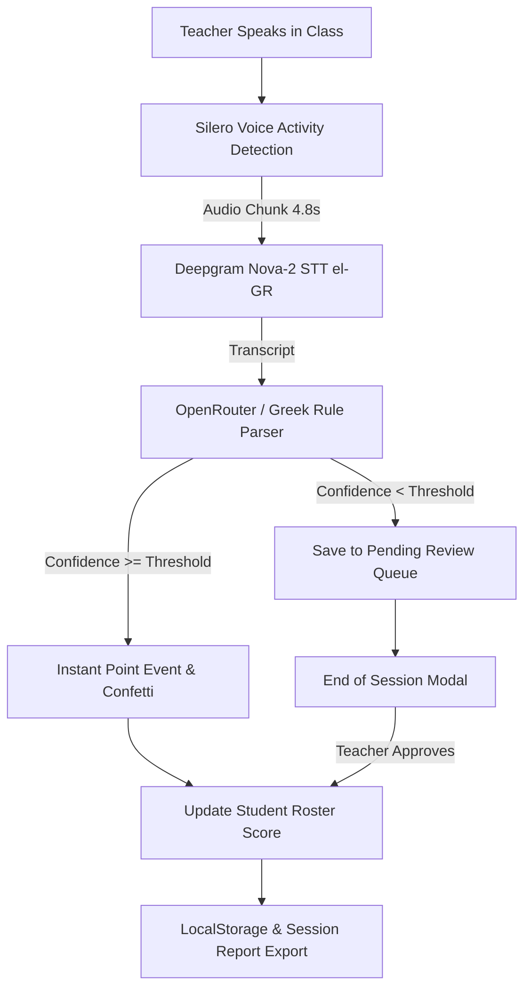

# Talli ⚡ Ambient Classroom Intelligence

> **Real-time Greek speech recognition for Cyprus Primary Education.**  
> Talli passively listens to teacher dialogue during class, automatically detecting praise and discipline cues in natural spoken Greek, recognizing student names in vocative declension, and awarding points live with zero teacher distraction.

---

## ✨ Features

- 🎙️ **Ambient Greek Speech Recognition (`el-GR`)**
  - Powered by Deepgram Nova-2 speech-to-text API and `@ricky0123/vad-web` Silero Voice Activity Detection.
  - Slices continuous audio into optimized 4.8-second buffers for sub-second recognition latency.

- 🧠 **Greek Vocative Declension Engine**
  - Built-in recognition for direct Greek address vocatives (*"Γιάννη"*, *"Ελένη"*, *"Ανδρέα"*, *"Νίκο"*, *"Πέτρο"*, *"Κώστα"*).
  - Automatically matches spoken vocatives to official student names in your class roster.

- ⚡ **Multi-Student Multi-Point Detection**
  - Single-pass structured parsing via OpenRouter LLM schema & fallback regex.
  - Commands like *"Μπράβο Ελένη, πολύ ωραία Γιάννη!"* award positive points to both students simultaneously.

- 🛡️ **End-of-Session Pending Point Review**
  - Low-confidence or ambiguous voice cues are automatically saved to a session `pending` queue.
  - Interactive approval screen at session end allows one-click bulk or individual approval/discard before report finalization.

- 🇨🇾 **Cyprus Primary School System Architecture**
  - Native support for all 36 Cyprus primary class sections (**Δημοτικό Α'1 - ΣΤ'6**).
  - Class-specific score tracking, roster filters, and persistent state hydration.

- 🎨 **Hyper-Expressive Neobrutalist UI Design**
  - High-contrast retro brutalism, bold typography, tactile micro-animations, confetti celebrations, and accessible color tokens.

---

## 🏗️ Architecture Flow



---

## 🛠️ Technology Stack

- **Framework:** Next.js 14 (App Router)
- **Language:** TypeScript
- **Styling:** TailwindCSS + Custom Neobrutalist Utility Tokens
- **Animations:** Framer Motion + Canvas Confetti
- **Voice Activity Detection:** `@ricky0123/vad-web` (Silero VAD)
- **Speech Recognition (STT):** Deepgram API (`nova-2` el-GR)
- **Intelligence & Parsing:** OpenRouter API (`google/gemini-2.5-flash`)
- **Icons:** Lucide React

---

## 🚀 Getting Started

### Prerequisites

- Node.js 18.x or later
- npm or yarn

### Installation

1. **Clone the repository:**
   ```bash
   git clone https://github.com/eliasliasides/Talli.git
   cd Talli
   ```

2. **Install dependencies:**
   ```bash
   npm install
   ```

3. **Set up environment variables:**
   Create a `.env.local` file in the root directory:
   ```env
   DEEPGRAM_API_KEY=your_deepgram_api_key
   OPENROUTER_API_KEY=your_openrouter_api_key
   ```

4. **Run the development server:**
   ```bash
   npm run dev
   ```

5. Open **`http://localhost:3000`** in Google Chrome or Microsoft Edge.

---

## 📁 Directory Structure

```text
├── src/
│   ├── app/
│   │   ├── api/
│   │   │   └── listen/         # Deepgram STT & OpenRouter detection route
│   │   ├── classroom/          # Live classroom tracking screen & review modal
│   │   ├── reports/            # Analytics & session history report page
│   │   ├── settings/           # Audio sensitivity & API configuration page
│   │   ├── students/           # Class roster & student management page
│   │   └── page.tsx            # Main Neobrutalist dashboard hub
│   ├── components/             # Reusable UI components (Header, SessionSetupModal)
│   ├── context/                # AppContext state & Cyprus classes schema
│   ├── hooks/                  # useClassroomListener VAD & audio processing hook
│   └── lib/                    # Confetti effects & Greek text utilities
├── public/                     # Static assets & transparent branding logo
├── package.json
└── README.md
```

---

## 📜 License

This project is licensed under the **MIT License**.

---

<p align="center">
  Crafted for Cyprus Primary Educators 🇨🇾
</p>
