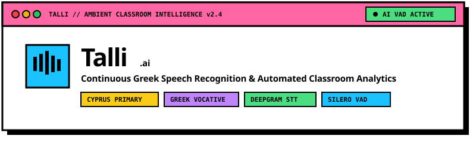

<p align="center">
  
</p>

<p align="center">
  <a href="https://git.io/typing-svg"></a>
</p>

<p align="center">
  <a href="https://nextjs.org"></a>
  <a href="https://www.typescriptlang.org"></a>
  <a href="https://deepgram.com"></a>
  <a href="https://tailwindcss.com"></a>
  <a href="https://github.com/ricky0123/vad"></a>
  <a href="./LICENSE"></a>
</p>

---

## Executive Summary

**Talli** is an ambient classroom copilot designed specifically for primary school teachers in Cyprus (Grades A'1 through F'6). 

Traditional classroom point tracking requires manual tablet input, disrupting teaching flow. Talli replaces manual logging by **passively listening to spoken Greek dialogue**, recognizing praise and discipline cues in natural speech, resolving direct Greek vocative names, and updating student participation scores in real time.

---

## Live STT & Multi-Student Parsing Demonstration

<p align="center">
  
</p>

---

## System Architecture & Processing Pipeline

<p align="center">
  
</p>

### Pipeline Stages

1. **Voice Activity Slicing:** Continuous audio captured via mic is sliced into 4.8-second PCM buffers using `@ricky0123/vad-web` (Silero VAD in WebAssembly).
2. **Speech-to-Text Stream:** Audio buffers pass directly to the Deepgram Nova-2 API tuned for `el-GR` Modern Greek speech.
3. **Vocative Declension Parsing:** Raw transcripts are evaluated via OpenRouter LLM schema constraints and deterministic Greek regex parsers.
4. **Instant Score Dispatch:** Cues matching confidence thresholds immediately trigger score increments and confetti animations.
5. **Pending Review Queue:** Low-confidence cues (below 85% confidence) are saved to an interactive review queue presented at session completion.

---

## Core Capabilities

### Ambient Speech Recognition (`el-GR`)
Zero-latency continuous VAD audio slicing ensures non-blocking speech recognition during active classroom instruction.

### Greek Vocative Declension Engine
Greek classroom speech uses direct address vocatives rather than nominative roster names (e.g., nominative *Γιάννης* → vocative *Γιάννη*, *Ανδρέας* → *Ανδρέα*, *Νίκος* → *Νίκο*). Talli automatically maps spoken vocatives back to official roster entries.

### Single-Pass Multi-Student Passing
Teachers frequently praise multiple students in a single utterance (e.g., *"Μπράβο Ελένη, πολύ ωραία Γιάννη!"*). Talli evaluates compound statements in a single pass, updating multiple student scores simultaneously.

### End-of-Session Pending Review
Low-confidence speech cues are safely stored during the lesson. When the teacher clicks "End Session", an interactive modal allows bulk or individual review before report finalization.

### Native Cyprus Primary System (Grades A'1 - F'6)
Built-in schema support for all 36 Cyprus primary class sections, with LocalStorage state hydration and CSV/JSON report exports.

---

## Neobrutalist Design Tokens

<p align="center">
  
</p>

| Token Name | Hex Code | System Application |
| :--- | :---: | :--- |
| Hot Pink | `#FF66A3` | Primary Action Launchpad & Discipline Highlights |
| Electric Blue | `#1AC2FF` | Active Class Configuration & Student Roster Cards |
| Emerald Green | `#4ADE80` | Live Praise Events, Confetti & End Session CTA |
| Sunburst Yellow | `#FACC15` | Report Summaries & Session History Cards |
| Vibrant Purple | `#C084FC` | Dynamic Voice Cue Reference & Cheat Sheet |
| Pitch Black | `#000000` | Hard 3px Outer Borders & Offset Shadows (`4px`, `8px`, `12px`) |

---

## Spoken Greek Voice Cue Specifications

| Spoken Cue Pattern | Target Roster Student | Classification | Point Delta |
| :--- | :--- | :---: | :---: |
| *"Μπράβο Ελένη, εξαιρετική απάντηση!"* | Eleni M. | Praise | `+1 PTS` |
| *"Πολύ ωραία Γιάννη!"* | Yiannis P. | Praise | `+1 PTS` |
| *"Σταμάτα Νίκο, πρόσεχε στο μάθημα!"* | Nikos L. | Discipline | `-1 PTS` |
| *"Έλα ρε Ανδρέα, ησυχία!"* | Andreas K. | Discipline | `-1 PTS` |
| *"Μπράβο Μαρία, πολύ ωραία Κώστα!"* | Maria K. &amp; Kostas S. | Multi-Praise | `+1 PTS Each` |

---

## Technology Stack

| Component | Technology / Library |
| :--- | :--- |
| Framework | Next.js 14 (App Router) |
| Language | TypeScript 5 |
| Styling | TailwindCSS + Neobrutalist Utility System |
| UI Motion | Framer Motion + Canvas Confetti |
| Audio VAD | `@ricky0123/vad-web` (Silero VAD ONNX WASM) |
| Speech STT | Deepgram API (`nova-2` el-GR) |
| NLP Parsing | OpenRouter API (`google/gemini-2.5-flash` JSON Schema) |

---

## Getting Started

### Requirements
- Node.js `v18.x` or higher
- npm or yarn

### 1. Installation
```bash
git clone https://github.com/Qu4rk/Talli.git
cd Talli
npm install
```

### 2. Environment Variables
Create a `.env.local` file in the root directory:
```env
DEEPGRAM_API_KEY=your_deepgram_api_key
OPENROUTER_API_KEY=your_openrouter_api_key
```

### 3. Execution
```bash
npm run dev
```
Navigate to `http://localhost:3000` in Google Chrome or Microsoft Edge.

---

## Repository Structure

```text
Talli/
├── public/
│   ├── assets/                 # Animated SVG assets & branding
│   └── silero_vad.onnx         # ONNX WASM VAD model binaries
├── src/
│   ├── app/
│   │   ├── api/listen/         # Deepgram STT & OpenRouter endpoint
│   │   ├── classroom/          # Live classroom tracking & pending review
│   │   ├── reports/            # Analytics & session report history
│   │   ├── settings/           # Audio sensitivity & API key config
│   │   ├── students/           # Class roster management
│   │   └── page.tsx            # Main Neobrutalist dashboard hub
│   ├── components/             # Header & SessionSetupModal
│   ├── context/                # AppContext & Cyprus class schema
│   ├── hooks/                  # useClassroomListener VAD audio processor
│   └── lib/                    # Confetti effects & Greek text utilities
└── README.md
```

---

## License

This software is released under the **MIT License**.
