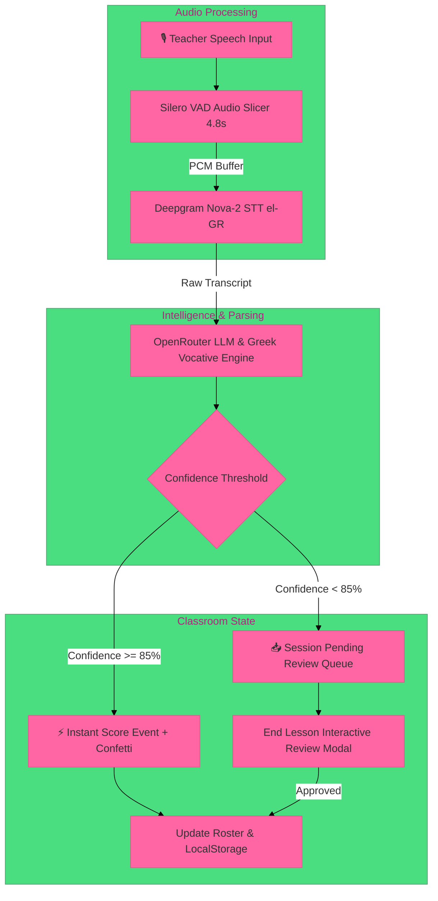

<p align="center">
  
</p>

<h1 align="center">⚡ Talli | Ambient Classroom Intelligence</h1>

<p align="center">
  <b>Passive Greek speech recognition & automated student participation tracking for Cyprus Primary Education 🇨🇾</b>
</p>

<p align="center">
  <a href="https://nextjs.org"></a>
  <a href="https://www.typescriptlang.org"></a>
  <a href="https://deepgram.com"></a>
  <a href="https://tailwindcss.com"></a>
  <a href="https://github.com/ricky0123/vad"></a>
  <a href="./LICENSE"></a>
</p>

---

## 🌟 Overview

**Talli** is an ambient classroom copilot designed specifically for primary school teachers in Cyprus (**Δημοτικό Α'1 - ΣΤ'6**). 

Instead of forcing teachers to tap buttons or carry a tablet while teaching, Talli **passively listens to natural classroom speech**, detects praise and discipline cues in spoken Greek (*"Μπράβο Ελένη!"*, *"Σταμάτα Νίκο!"*), parses direct vocative names, and updates student participation scores in real time with **sub-second latency**.

---

## 🎨 Neobrutalist Brand System

Talli is crafted using a high-contrast, tactile **Neobrutalist Design System** engineered for clarity under bright classroom lighting:

| Color Token | Hex | Application |
| :--- | :---: | :--- |
| 💖 **Hot Pink** | `#FF66A3` | Primary Action Launchpad & Negative Discipline Badges |
| 🩵 **Electric Blue** | `#1AC2FF` | Active Class Config & Student Roster Cards |
| 💚 **Emerald Green** | `#4ADE80` | Live Praise Events, Confetti & End Session CTA |
| 💛 **Sunburst Yellow** | `#FACC15` | Report Summaries & Session History Cards |
| 💜 **Vibrant Purple** | `#C084FC` | Dynamic Voice Cue Reference & Grammar Tools |
| 🖤 **Pitch Black** | `#000000` | 3px Hard Borders & Drop Shadows (`4px`, `8px`, `12px`) |

---

## 🚀 Key Features

### 🎙️ Ambient Greek Speech Recognition (`el-GR`)
- Uses **Deepgram Nova-2** model tuned for Modern Greek pronunciation.
- Powered by **Silero Voice Activity Detection (VAD)** in WebAssembly, automatically slicing speech into continuous 4.8s buffers to guarantee instant response.

### 🧠 Greek Vocative Declension Engine
- Greek classroom speech uses vocative case (e.g., nominative *Γιάννης* → vocative *Γιάννη*, *Ανδρέας* → *Ανδρέα*, *Νίκος* → *Νίκο*).
- Talli's intelligence layer automatically resolves vocatives back to official student records in your roster.

### ⚡ Multi-Student Multi-Point Passing
- Teachers often give fast consecutive praise (e.g., *"Μπράβο Ελένη, πολύ ωραία Γιάννη!"*).
- Talli parses multi-student statements in a single pass, awarding positive points to all mentioned students simultaneously.

### 🛡️ End-of-Session Pending Review Workflow
- Any speech cues with confidence below auto-approve thresholds (e.g., < 85%) are safely held in a `pending` queue.
- At lesson completion, teachers can review, bulk-approve, or discard unsure points before generating official session reports.

### 🇨🇾 Built for Cyprus Primary Education
- Pre-configured for all **36 Cyprus Primary Class Sections** (**Δημοτικό Α'1 - ΣΤ'6**).
- Full LocalStorage state persistence, student score tracking, and CSV/JSON report exports.

---

## 🏗️ System Architecture



---

## 🗣️ Greek Voice Cues Cheat Sheet

| Spoken Cue Example | Targeted Student | Result | Score Delta |
| :--- | :--- | :---: | :---: |
| *"Μπράβο Ελένη, εξαιρετική απάντηση!"* | Ελένη Μ. | 💚 Praise | `+1 Point` |
| *"Πολύ ωραία Γιάννη!"* | Γιάννης Π. | 💚 Praise | `+1 Point` |
| *"Σταμάτα Νίκο, πρόσεχε στο μάθημα!"* | Νίκος Λ. | 💖 Discipline | `-1 Point` |
| *"Έλα ρε Ανδρέα, ησυχία!"* | Ανδρέας Κ. | 💖 Discipline | `-1 Point` |
| *"Μπράβο Μαρία, πολύ ωραία Κώστα!"* | Μαρία Κ. & Κώστας Σ. | 💚 Multi-Praise | `+1 Point Each` |

---

## 🛠️ Technology Stack

- **Frontend:** [Next.js 14](https://nextjs.org/) (App Router), TypeScript, React 18
- **Styling & UI:** TailwindCSS, Custom Neobrutalist Shadow Tokens, Lucide Icons
- **Animations:** Framer Motion, Canvas Confetti
- **Voice Activity Detection:** `@ricky0123/vad-web` (Silero VAD via ONNX WebAssembly)
- **Speech-to-Text:** [Deepgram API](https://deepgram.com/) (`nova-2` el-GR)
- **NLP & Parsing:** OpenRouter API (`google/gemini-2.5-flash` with JSON Schema constraint)

---

## ⚡ Quickstart & Setup

### Prerequisites
- **Node.js:** `v18.x` or higher
- **Package Manager:** `npm` or `yarn`

### 1. Clone & Install
```bash
git clone https://github.com/Qu4rk/Talli.git
cd Talli
npm install
```

### 2. Configure Environment Variables
Create a `.env.local` file in the root directory:
```env
DEEPGRAM_API_KEY=your_deepgram_api_key
OPENROUTER_API_KEY=your_openrouter_api_key
```

### 3. Run Development Server
```bash
npm run dev
```
Open **`http://localhost:3000`** in your browser.

---

## 📁 Repository Structure

```text
Talli/
├── public/                     # Logo assets & ONNX WASM VAD binaries
├── src/
│   ├── app/
│   │   ├── api/listen/         # Deepgram STT & OpenRouter detection route
│   │   ├── classroom/          # Live classroom tracking & End-Session review
│   │   ├── reports/            # Analytics & session history exports
│   │   ├── settings/           # Audio sensitivity & API configuration
│   │   ├── students/           # Class roster management
│   │   └── page.tsx            # Main Neobrutalist dashboard hub
│   ├── components/             # Reusable UI (Header, SessionSetupModal)
│   ├── context/                # AppContext & Cyprus Primary class schemas
│   ├── hooks/                  # useClassroomListener VAD audio processing
│   └── lib/                    # Confetti effects & Greek text utilities
└── README.md
```

---

<p align="center">
  Designed with ❤️ for Cyprus Primary Educators 🇨🇾
</p>
