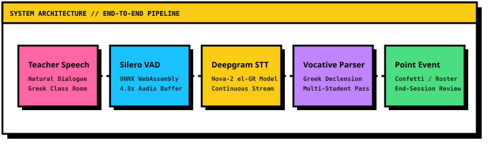
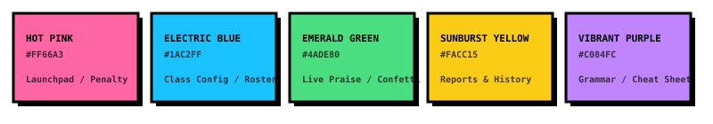

<p align="center">
  
</p>

<p align="center">
  
</p>

<p align="center">
  <a href="https://git.io/typing-svg"></a>
</p>

<p align="center">
  <a href="https://nextjs.org"></a>
  <a href="https://www.typescriptlang.org"></a>
  <a href="https://deepgram.com"></a>
  <a href="https://github.com/ricky0123/vad"></a>
  <a href="https://tailwindcss.com"></a>
  <a href="https://openrouter.ai"></a>
  <a href="./LICENSE"></a>
</p>

---

## Executive Summary

**Talli** is an ambient classroom copilot purpose-built for primary school teachers in Cyprus across all 36 standard class sections (Grades **A'1** through **F'6**). 

In active primary classrooms, manual tablet or whiteboard point logging breaks teaching flow. Talli eliminates manual entry by **passively monitoring spoken Greek classroom dialogue**, detecting praise and correction triggers, converting spoken Greek vocatives into official roster names, and dispatching merit points in real time.

---

## Live STT & Multi-Student Parsing Console

<p align="center">
  
</p>

---

## Greek Vocative Declension Engine

In Modern Greek, teachers address students using the **vocative case** rather than official nominative roster names (e.g., nominative *Γιάννης* → vocative *Γιάννη*, *Ανδρέας* → *Ανδρέα*, *Νίκος* → *Νίκο*, *Πέτρος* → *Πέτρο*, *Κώστας* → *Κώστα*). 

Talli features an automated Greek declension parser that resolves spoken vocatives back to roster student records.

<p align="center">
  
</p>

---

## System Architecture & Processing Pipeline

<p align="center">
  
</p>

### Pipeline Stages

1. **Voice Activity Slicing:** Microphone audio is continuously monitored and sliced into 4.8-second PCM buffers using `@ricky0123/vad-web` (Silero VAD in WebAssembly).
2. **Speech-to-Text Stream:** Audio buffers pass to the Deepgram Nova-2 API tuned for `el-GR` Modern Greek speech with dynamic roster keyword boosting.
3. **Accent-Insensitive Vocative Engine:** Transcripts are processed through `removeAccents` normalization and OpenRouter LLM schema parsers to resolve direct Greek vocatives.
4. **Instant Score Dispatch:** Cues exceeding the auto-approve confidence threshold (default 85%) immediately trigger point increments and confetti animations.
5. **Pending Review Queue:** Low-confidence cues are saved to an interactive review queue presented at session completion.

---

## Neobrutalist Design Tokens

<p align="center">
  
</p>

| Token Name | Hex Code | System Application |
| :--- | :---: | :--- |
| Hot Pink | `#FF66A3` | Primary Action Launchpads & Discipline Highlights |
| Electric Blue | `#1AC2FF` | Active Class Configuration & Student Roster Cards |
| Emerald Green | `#4ADE80` | Live Praise Events, Confetti & End Session CTA |
| Sunburst Yellow | `#FACC15` | Report Summaries & Session History Cards |
| Vibrant Purple | `#C084FC` | Voice Cue Reference Guide & Settings Header |
| Pitch Black | `#000000` | Hard 3px Outer Borders & Offset Shadows (`4px`, `8px`, `12px`) |

---

## Spoken Greek Voice Cue Specifications

| Spoken Cue Pattern | Target Roster Student | Classification | Point Delta |
| :--- | :--- | :---: | :---: |
| *"Μπράβο Ελένη, εξαιρετική απάντηση!"* | Eleni M. | Praise | `+1 PTS` |
| *"Πολύ ωραία Γιάννη!"* | Yiannis P. | Praise | `+1 PTS` |
| *"Σταμάτα Νίκο, πρόσεχε στο μάθημα!"* | Nikos L. | Discipline | `-1 PTS` |
| *"Έλα ρε Ανδρέα, ησυχία!"* | Andreas T. | Discipline | `-1 PTS` |
| *"Μπράβο Μαρία, πολύ ωραία Κώστα!"* | Maria K. &amp; Kostas S. | Multi-Praise | `+1 PTS Each` |

---

## Core Capabilities & UX Features

### Single-Pass Multi-Student Passing
Teachers frequently praise multiple students in a single utterance (e.g., *"Μπράβο Ελένη, πολύ ωραία Γιάννη!"*). Talli evaluates compound statements in a single pass, updating multiple student scores simultaneously.

### 2-Step End-of-Session Pending Review
Uncertain speech cues (< 85% confidence) are stored in a pending queue. Clicking **"End Session"** triggers a 2-step review modal:
- **Step 1:** Review pending items with individual **Approve (✓)** / **Discard (✕)** controls or bulk action shortcuts.
- **Step 2:** Final summary screen calculating overall participation rates, triggering confetti celebrations, and exporting reports.

### Non-Clattering Smart Class Switcher
The class selection bar automatically caps quick-access pills to at most **4 featured classes** (active class + top 3 enrolled classes) while providing a dropdown selector for all **36 Cyprus Primary Classes** (`Τάξη Α'1` – `Τάξη ΣΤ'6`).

---

## Technology Stack

| Component | Technology / Library |
| :--- | :--- |
| Framework | Next.js 14 (App Router) |
| Language | TypeScript 5 |
| Styling | TailwindCSS + Neobrutalist Utility System |
| Motion | Framer Motion + Canvas Confetti |
| Audio VAD | `@ricky0123/vad-web` (Silero VAD ONNX WASM) |
| Speech STT | Deepgram API (`nova-2` el-GR) |
| NLP Parsing | OpenRouter API (`google/gemini-2.5-flash` JSON Schema) |

---

## Getting Started

### Requirements
- Node.js `v18.x` or higher
- npm or yarn

### 1. Installation
```bash
git clone https://github.com/Qu4rk/Talli.git
cd Talli
npm install
```

### 2. Environment Setup
Create a `.env.local` file in the root directory:
```env
DEEPGRAM_API_KEY=your_deepgram_api_key
OPENROUTER_API_KEY=your_openrouter_api_key
```

### 3. Execution
```bash
npm run dev
```
Navigate to `http://localhost:3000` in Google Chrome or Microsoft Edge.

---

## Repository Structure

```text
Talli/
├── public/
│   ├── assets/                 # Animated Neobrutalist SVG assets & hero graphics
│   │   ├── logo-transparent.png
│   │   ├── readme-hero.svg
│   │   ├── readme-stt-demo.svg
│   │   ├── readme-vocative.svg
│   │   ├── readme-pipeline.svg
│   │   └── readme-palette.svg
│   └── silero_vad.onnx         # ONNX WASM VAD model binaries
├── src/
│   ├── app/
│   │   ├── api/listen/         # Deepgram STT & OpenRouter intent parser endpoint
│   │   ├── classroom/          # Live classroom tracking & 2-step pending review modal
│   │   ├── reports/            # Student rewards podium & session history
│   │   ├── settings/           # Audio sensitivity, microphone hardware & model config
│   │   ├── students/           # Class roster & subcategory tag management
│   │   └── page.tsx            # Main Neobrutalist dashboard hub
│   ├── components/             # Header, SessionSetupModal & WavySlider
│   ├── context/                # AppContext & Cyprus 36-class schema
│   ├── hooks/                  # useClassroomListener VAD audio processor
│   └── lib/                    # Confetti effects & Greek accent utilities
└── README.md
```

---

## License

This software is released under the **MIT License**.
